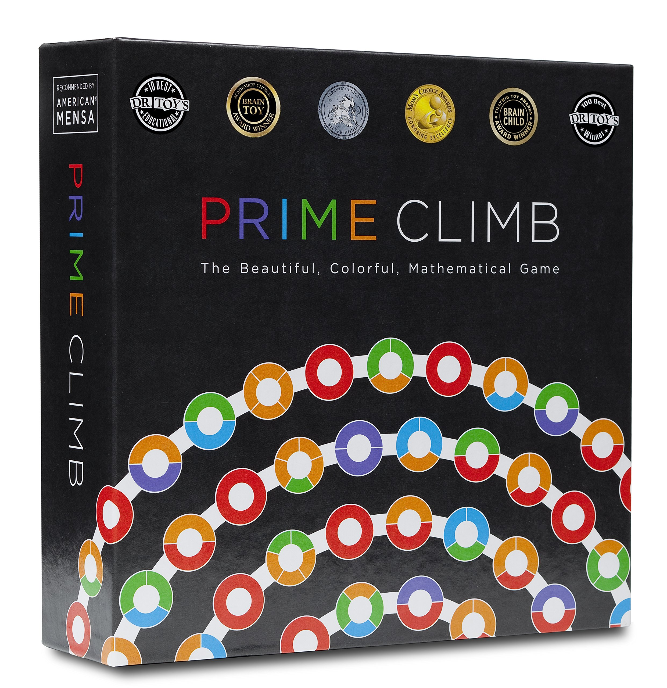
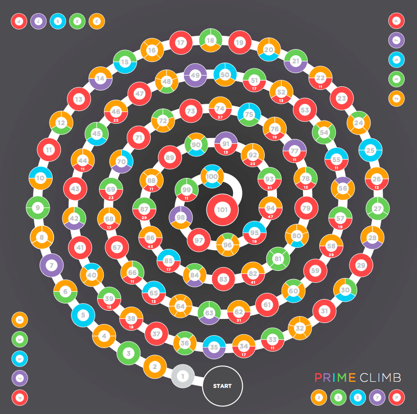

# Solving Prime Climb

## What is prime climb?

{:width="300px" height="300px"}

Primeclimb is a math based board game with the goal of getting 2 of your pieces from 0 to exactly 101 before everyone else. It uses arithmetic on the numbers on two dice rolls as a form of movement. These dice are numbered from 1 - 10, and operations include addition, multiplcation subtraction and division. 

## Rules

{:width="300px" height="300px"}

This is the  board of which the game is played. We will simplify the game's rules to only the rolling and moving aspect.

  <iframe src="https://www.youtube.com/embed/tWhVw3mTpPU" frameborder="0" allow="accelerometer; autoplay; clipboard-write; encrypted-media; gyroscope; picture-in-picture" allowfullscreen></iframe>

[Here are the full rules if you're interested](https://mathforlove.com/2010/01/prime-climb-rules/)

## Naive approach 1: Greedy Algorithm - Sum-max

A new player will typically have a gameplan involving maximizing the sum of their pieces each turn. This usually involves multiplying their pieces until further multiplication is impossible due to results being above 101. They would then proceed to continuously add rolls until 101. Near 101, they may be forced to subtract due to needing to reach 101 exactly. 

### Why is this ineffective?

Similar to the principle of lookahead in games such as chess, the disadvantage is that maximizing the current sum can mean putting pieces in ineffective squares. 

An intuitive example of this, is that since half of the map requires addition (51 -> 100) to increase up, it's rarely effective to enter the range of 51 -> 80. The overall flaw of the plan is that it's a greedy solution that doesn't consider how much farther one could travel on the next turn by tailoring which numbers you start the next turn on. 

To show this more rigourously, consider the expected number of moves to go from 51 to a value above 90. Rolling two 10-sided dice nets an average sum of 10. This means it will take 4 turns to go to 90+. Alternatively, if we consider the hypothetical strategy of having a pawn hover around 30 and another pawn hovering around 50, each dice has a 2/10 chance to roll either a 2 or a 3. When this happens, one of the pawns can go straight to 90s. The probability one of two dice rolls either a 2 or 3 is $$ 1 - (8/10)^2 = 0.36% $$. This has an expected value of 1.553 rolls, compared to the expected 4 rolls from sums. 

## Naive approach 2: Lookahead sum-max

If our goal is to not nessesarily move to squares that 

### Finding a solution

The approach I will go with is a top down approach 

