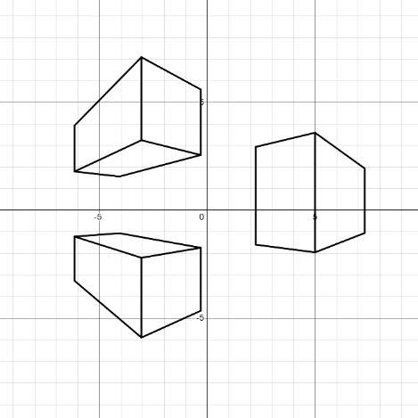
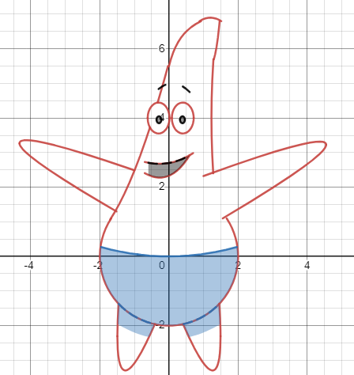
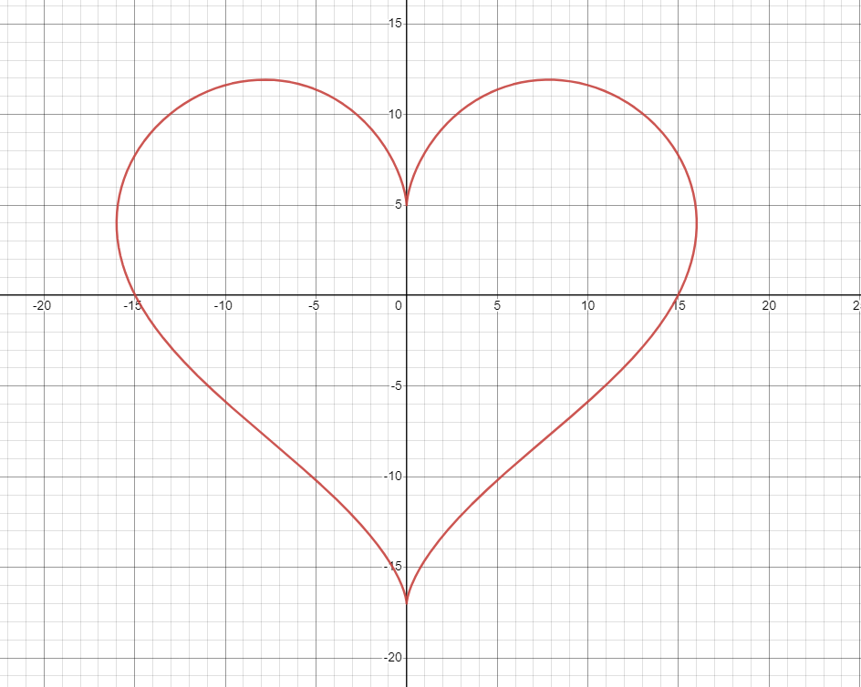

## Introduction to Desmos

[Desmos](https://www.desmos.com/calculator) serves as more than an online graphing calculator as in recent years, it's grown into sort of an instrument for conjuring art. It presents an unique way to express creavitiy in a visual way. You may think that it's byzantine for it's purpose but it has some advantages over all other mediums. 

1. Mathematical art can be infinite, as the math itself is not bound by any canvas.
2. Animations can be done efficiently and accurately. Animating by hand is tough work, but with math, motion can be described precisely with the physical equations of the world.
3. Provides insight into the nature of natural geometries, perspective, motion and vision as you break down things into it's constituent mathematical properties and objects.

## Demonstration of Art with Desmos

Through Desmos, mathematical functions reveal their unexpected versatility, transforming into visually stunning artworks. From elementary shapes to elaborate designs, Desmos empowers artists to navigate the elegance of mathematics in a distinctly visual manner. Here is one of my favourite videos of a community member's desmos creations. It highlights the visually stunning capabiltiies of math by just an individual in 2 months. 

<iframe style="position: absolute; top: 0; left: 0; width: 100%; height: 100%;" src="https://www.youtube.com/embed/4_8eY_Ij-5k" title="YouTube video player" frameborder="0" allow="accelerometer; autoplay; clipboard-write; encrypted-media; gyroscope; picture-in-picture" allowfullscreen></iframe>

## My first introduction into Mathematical Art

Recent years, the growth of Desmos.com has brough mathematical art to a wider audience, but it was even more niche in the past than it is today. Around 2012, during my elementary school years, the only known "math" art had been impractical for an average person. Graphing calculators were for the most part, handheld and very tedious to work with. At most, some people have graphed the expression for a heart, and some smart and dedicated people on the internet have made maybe a batman symbol. It was after my one of my math teachers showed us a little math video showing us the math within our daily lives, was I determined to draw with math. 

<iframe style="position: absolute; top: 0; left: 0; width: 100%; height: 100%;" src="https://www.youtube.com/embed/kkGeOWYOFoA" title="YouTube video player" frameborder="0" allow="accelerometer; autoplay; clipboard-write; encrypted-media; gyroscope; picture-in-picture" allowfullscreen></iframe>

## Expressions Most Useful for Art

The journey into Desmos art begins with an understanding of the fundamental mathematical expressions and their potential for visual representation. This discourse introduces pivotal functions and concepts, laying the groundwork for artistic exploration.

### Linear

Linear functions, epitomized by the equation $$y = mx + b$$, lay the groundwork for crafting straight lines, an essential element in both abstract and representational art within Desmos.

For instance, consider the linear function: $$ y = mx + b\cdot \{ |x - a_1| < a_2 \} $$

Cityscapes and angular abstract art can often be drawn with only a few linear functions. 

{:width="200px" height="200px"}

### Conic Sections

Conic sections expand the artist's palette with curves derived from the intersections of a plane with a cone, including circles, ellipses, parabolas, and hyperbolas, each offering unique aesthetic contributions to Desmos art.

Here is an example graph of Patrick that demos the use of many types of conic sections. 

{:width="200px" height="200px"}

### Splines

Splines, particularly useful for creating smooth curves that pass through a set of points, offer flexibility in design and are instrumental in drawing complex shapes and patterns with grace and precision.

### Fun Expressions to Know

Certain expressions, such as those forming the shape of a heart or a flower, introduce an element of whimsy and creativity, showcasing the delightful possibilities within the realm of mathematical art.

{:width="300px" height="300px"}

## Coloring and Domain Layering

This technique unveils how to imbue Desmos art with color and texture, employing domain restrictions and layering to infuse works with depth and vibrancy.

## Animation and Sliders

The dynamism of art is explored through animation and sliders, transforming static images into narratives of motion and change, thus breathing life into mathematical constructs.

<iframe src="https://www.desmos.com/calculator/wyvgcujo4p" width="100%" style="min-height:400px"></iframe>

## 3D Graphing

Venturing into the third dimension, this section elucidates the process of crafting and animating 3D graphs in Desmos, adding depth and complexity to the artistic endeavor.

<iframe src="https://www.desmos.com/calculator/yl7ftbic4g" width="100%" style="min-height:400px"></iframe>

## Lag Management

As creations grow in complexity, so too does the potential for lag. This discussion provides strategies for managing performance, ensuring a smoother rendering of intricate art.

## Lossy Rendering

This concept explores the balance between detail and computational efficiency, discussing techniques for achieving detailed artistic expressions within the constraints of Desmos.

## Desmos Community

The Desmos community represents a vibrant collective of individuals sharing ideas, techniques, and their art, enriching the experience of all who participate. This section offers a gateway to engaging with fellow Desmos artists, fostering a sense of camaraderie and mutual inspiration.

## In Closing

Prominent mathematicians and philosophers have pondered whether math is a discovery or an invention. I believe it falls into the realm of discovery. Math itself is not a tangible object but rather a concept; it exists inherently, not necessitating our conceptualization to be. However, the methods we employ to describe, comprehend, and communicate mathematical ideas are indeed inventions. Whenever you create something new on Desmos, you are engaging in an act of one of invention or reinvention. So, I encourage you to venture forth and invent.
