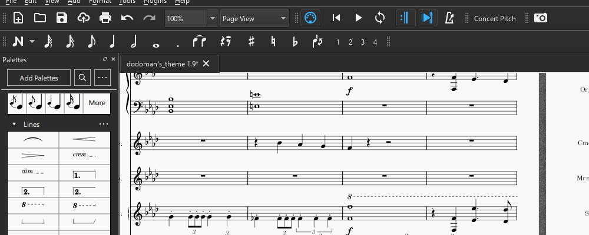

# Music & AI - My Compositions

I like to play and write music. Can AI do it better? Here are some compositions I've done over the years. 

{:width="1000px" height="400px"}

## Dodoman's Theme

This piece was composed in 2021, and written for a symphonic orchestra with a choir. My magnus opum thus far.

The music takes light inspiration from Schubert Ständchen and Luigi's mansion. 

<html>
<body>
<iframe src="https://www.youtube.com/embed/8N39upFgpts" frameborder="0" allow="accelerometer; autoplay; clipboard-write; encrypted-media; gyroscope; picture-in-picture" allowfullscreen style="position: absolute; top: 0; left: 0; width: 100%; height: 100%;"></iframe>
</body>
</html>

## My September

This piece is from September 2023, as suggested by the name. Written for solo piano. 

<html>
<body>
  <audio controls>
    <source src="../assets/audio/myseptember.mp3" type="audio/mpeg">
  </audio>
</body>
</html>

## 8 bit nostalgia

This 2023 piece is written for solo piano but recorded as a synthesizer. I try to sound nostalgic and feature a guilty crown easter egg. 

<html>
<body>
  <audio controls>
    <source src="../assets/audio/8_bit_nostalgia.mp3" type="audio/mpeg">
  </audio>
</body>
</html>

## 3 Hands

This 2023 3-handed piano piece was initally inspired by a tune I heard someone hum. 

<html>
<body>
  <audio controls>
    <source src="../assets/audio/4hand_remix.mp3" type="audio/mpeg">
  </audio>
</body>
</html>

## Game OST 4

This is 2018 orchestral piece is inspired from Sonny music.

<html>
<body>
  <audio controls>
    <source src="../assets/audio/Game_OST_4.mp3" type="audio/mpeg">
  </audio>
</body>
</html>

## Sadge in C

An incomplete draft for solo synthesizer piano written in 2018.

<html>
<body>
  <audio controls>
    <source src="../assets/audio/sadgeC.mp3" type="audio/mpeg">
  </audio>
</body>
</html>

## Puddings day off

This experimental piece written in 2023 scores the life of my rabbit as she runs for her life from the vacuum, only to stumble herself into an oasis of celery sticks. 

<html>
<body>
  <audio controls>
    <source src="../assets/audio/Puddings_day_off.mp3" type="audio/mpeg">
  </audio>
</body>
</html>

## Game OST 2

This 2017 piece is my first orchestral piece, drawing light inspiration from maplestory OSTs.

<html>
<body>
  <audio controls>
    <source src="../assets/audio/Game_OST_3.mp3" type="audio/mpeg">
  </audio>
</body>
</html>

## Violin nostalgia

2017 piece written for violin piano duet sounds nostalgic for some reason. 

<html>
<body>
  <audio controls>
    <source src="../assets/audio/violin_nostalgia.mp3" type="audio/mpeg">
    Your browser does not support the audio element.
  </audio>
</body>
</html>

## Autumn Leaves variations

Variations on autumn leaves for our jazz band. This  WIP was arranged in 2023. It features a classical and jazz style so far.

<html>
<body>
  <audio controls>
    <source src="../assets/audio/Tim's Leaves.mp3" type="audio/mpeg">
    Your browser does not support the audio element.
  </audio>
</body>
</html>

