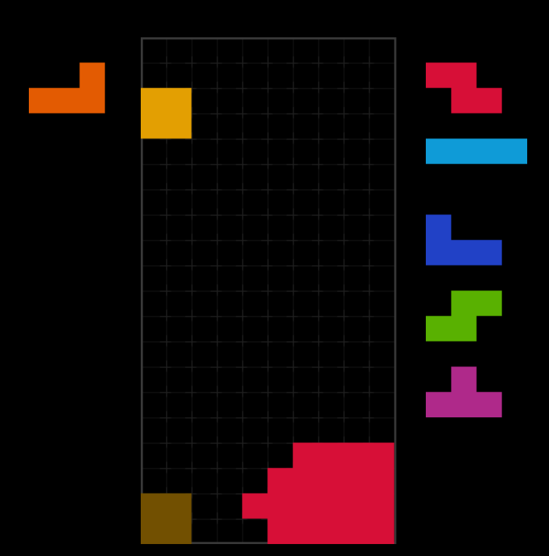
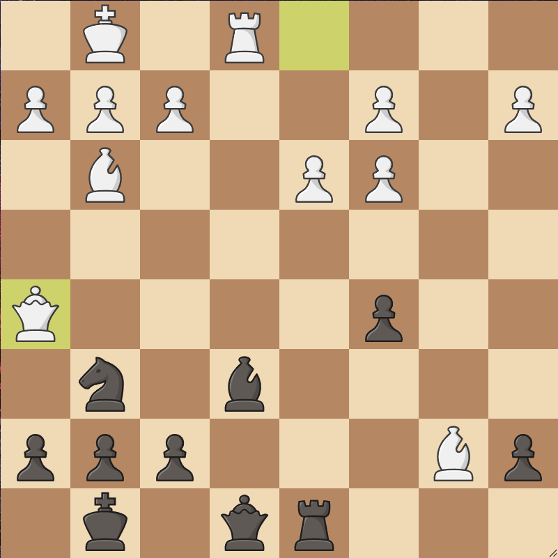

insert self-referencing riddle generator code here

insert fermi estimation puzzle generator code here

<!-----------------------------TETRIS PUZZLE ----------------------------->

<h2>Tetris Puzzles</h2>

A surprisingly hard puzzle that may arise from PCO. 

The goal is to fully clear the board.

 
<a href="https://jstris.jezevec10.com/?play=6&map=51132" target="_blank">Play it yourself!</a>

  <button onclick="toggleSpoiler('tetrisSpoiler1')">Show/Hide Hint</button>
  

    Piece order: O L I Z S. Three of the pieces need to be spun in.
  

<!-----------------------------CHESS PUZZLE ----------------------------->

<h2>Chess Puzzles</h2>

Difficulty: ~2400

  <button onclick="toggleSpoiler('chessSpoiler1')">Show/Hide Solution</button>
  

    1... Bg4 2. Rxe8+ Rxe8 3. f3 Bxh5 ... or 3. h3 Bxh5
    This queen sacrifice creates a fork between the enemy queen and the threat of a backrank mate!
  

<!-----------------------------LOGIC PUZZLE ----------------------------->

    <h2>Logic Puzzles</h2>
    
New puzzles are cycled in every month!

    

        <h3 style=": #6666FF;">Meta Puzzle</h3>
        
What is the correct answer?

        <ol>
            <li>All of the below</li>
            <li>None of the below</li>
            <li>All of the above</li>
            <li>One of the above</li>
            <li>None of the above</li>
            <li>None of the above.</li>
        </ol>
    

    

        <h3 style=": #6666FF;">Triangle Puzzle</h3>
        
Draw 3 straight lines on top of this image to create 9 triangles:

        
    

    

        <h3 style=": #6666FF;">Scooter Puzzle</h3>
        
Amanda lives with her teenage son, Matt, in the countryside—a car ride away from Matt’s school. Every afternoon, Amanda leaves the house at the same time, drives to the school at a constant speed, picks Matt up exactly when his chess club ends at 5 p.m., and then they immediately return home together at the same constant speed. But one day, Matt isn’t feeling well, so he leaves chess practice early and starts to head home on his portable scooter.

        
After Matt has been scooting for an hour, Amanda comes across him in her car (on her usual route to pick him up), and they return together, arriving home 40 minutes earlier than they usually do. How much chess practice did Matt miss?

    

    

        <h3 style=": #6666FF;">Chameleon Puzzle</h3>
        
There are 13 Red, 15 Green, and 17 Blue Chameleons at some point of time. Whenever two Chameleons of the different s meet both of them change their  to the third . Is it ever possible for all Chameleons to become of the same ?

    

    

        <h3 style=": #6666FF;">Handshake Puzzle</h3>
        
Five couples, including Obama and Michelle, meet at a bar. Eager to greet one another, every person shakes hands with those they haven't previously met. After the greetings, Michelle asks everyone about the number of hands they shook and gets nine different answers.

        
Question: How many hands did Obama shake?

    

<!-----------------------------MATH PUZZLE ----------------------------->

    <h2>Math Puzzle</h2>

    

        <h3 style=": #6666FF;">The Four 4's Puzzle</h3>
        
Using exactly four \(4\)'s and the operations \(+\), \(-\), \(\times\), \(\div\), \(\sqrt{x}\), and \(x^y\), and brackets, how many integers starting from 0 can you produce?

        
For instance: 
        \(0 = 44 - 44\)  
        \(1 = \frac{44}{44}\)  
        \(2 = \frac{4}{4} + \frac{4}{4}\)  
        ... and so on.
        

        
How many integers can you form?

        

            <h4 style=": #6666FF;">Bonus Challenge:</h4>
            
Can you generalize your solution to produce any positive integer?

        

    

